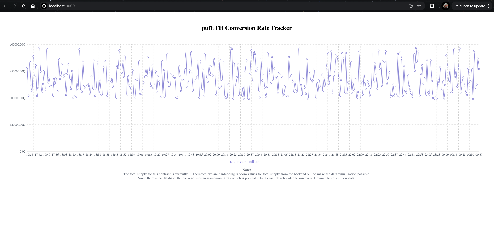

# pufETH Conversion Rate Tracker

This project is a full-stack application consisting of a microservice that tracks the pufETH conversion rate and a frontend to display the changes over time. The project includes a Node.js backend that interacts with a smart contract and a React frontend that visualizes the data.

## Project Setup

### Clone the Repository

First, clone the repository to your local machine

### Environment Variables

Create a `.env` file in the root directory of the backend to set up environment variables. You need to define the following variables:

`ETHEREUM_PROVIDER_URL` with your Ethereum provider URL (e.g., Infura or Alchemy).

## Backend Setup

1. **Navigate to the backend directory**:

2. **Install dependencies**: `npm install`

3. **Run the backend**: `npm start`

   The backend will start on port `4000` by default. You can modify the port in the backend configuration if necessary.

## Frontend Setup

1. **Navigate to the frontend directory**:

2. **Install dependencies**: `npm install`

3. **Run the frontend**: `npm start`

   The frontend will start on port `3000` by default. Open [http://localhost:3000](http://localhost:3000) in your browser to see the application.

## Running Both Services Together

- Ensure both the backend and frontend are running concurrently.
- The backend provides the conversion rate data, while the frontend visualizes it.

## Project Details

### Backend

- The backend is a microservice written in Node.js that interacts with the Ethereum blockchain to retrieve conversion rate data.
- The conversion rate is calculated using values from the smart contract at `0x17D5F2803D9F922fa9C3A77849962df0D19e6674`.
- The data is stored in an in-memory array and updated every 1 minute by a cron job.

### Frontend

- The frontend is built using React and TypeScript.
- It displays a line chart visualizing the conversion rate over time.

## Note

- The total supply for the contract is currently 0, so random values are used to simulate data.
- Since there is no database, the backend uses an in-memory array which is populated by a cron job running every 1 minute.
